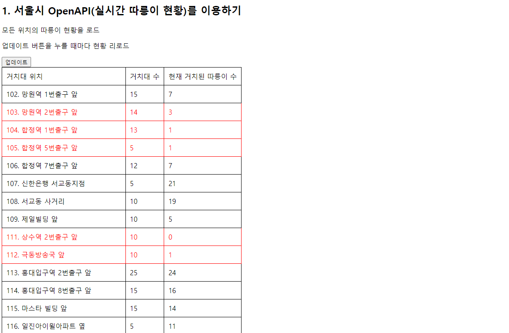

# Seoul-Public-Bike-Open-Api

- `Ajax`를 통한 기본 통신 원리 숙지
- 서울시 공공자전거 `open api` 활용

## Installation

```bash
# Default.
$


# Start!
$ Open in Default Browser
```

## Specs

- JQuery

<br />



<br />

## ajax.html

```html
<button onclick="q1()">업데이트</button>
```

```javascript
function q1() {
  $("#names-q1").empty();

  $.ajax({
    type: "GET",
    url: "http://spartacodingclub.shop/sparta_api/seoulbike",
    data: {},
    success: function (response) {
      let rows = response["getStationList"]["row"];

      for (let i = 0; i < rows.length; i++) {
        let name = rows[i]["stationName"];
        let bike = rows[i]["parkingBikeTotCnt"];
        let rack = rows[i]["rackTotCnt"];

        let temp_html = "";

        if (bike < 5) {
          temp_html = `<tr class="urgent">
           <td>${name}</td>
           <td>${rack}</td>
           <td>${bike}</td>
         </tr>`;
        } else {
          temp_html = `<tr>
           <td>${name}</td>
           <td>${rack}</td>
           <td>${bike}</td>
         </tr>`;
        }

        $("#names-q1").append(temp_html);
      }
    },
  });
}
```
